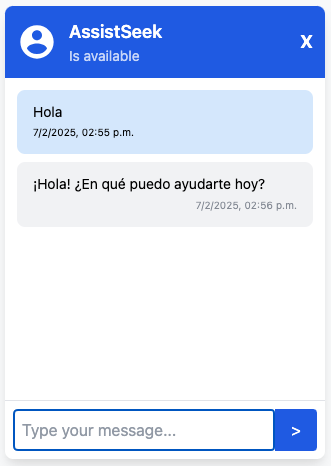

# AssistSeek

AssistSeek is a virtual assistant application that provides seamless interaction with the **Deepseek R1** large language model. It serves as an interface to harness the capabilities of Deepseek R1, enabling natural language conversations and intelligent responses for various tasks and queries.



## Features
- Modern and responsive UI built with [Tailwind CSS](https://tailwindcss.com/)
- [Flask](https://flask.palletsprojects.com)-powered backend for robust API handling
- Real-time markdown rendering using [marked.js](https://marked.js.org/)
- Seamless integration with Deepseek R1 through [Ollama](https://ollama.com/download)

## Prerequisites

- Install [Ollama](https://ollama.com/download).
- [Python](https://www.python.org/) 3.9 or higher.

## How to Use?

1. Create a virtual environment:
    ```sh
    python3 -m venv venv
    ```

2. Activate the virtual environment:
    ```sh
    source venv/bin/activate
    ```

3. Install the dependencies:
    ```sh
    pip install -r requirements.txt
    ```

4. In another terminal, run `deepseek-r1` model:
    ```sh
    ollama run deepseek-r1:1.5b
    ```

5. Execute flask app:
    ```sh
    python app.py
    ```

> **NOTE:** open the url [http://127.0.0.1:5000](http://127.0.0.1:5000) in a web browser to test it!
